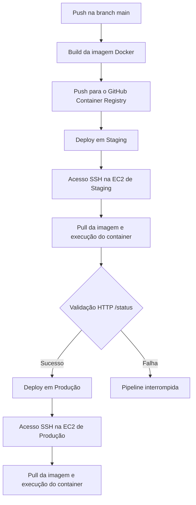

# Desafio DevOps - Lacrei Saúde

Este repositório contém minha solução para o desafio técnico da vaga de voluntariado em DevOps na Lacrei Saúde.

O objetivo do projeto foi colocar em prática conceitos que venho estudando para minha transição para DevOps, principalmente infraestrutura como código, containers e automação de deploy.

A solução utiliza AWS, Terraform, Docker e GitHub Actions para criar dois ambientes separados e automatizar o processo de entrega da aplicação.

## Arquitetura e ambientes

A infraestrutura foi provisionada com **Terraform**, permitindo manter a configuração dos recursos versionada junto ao projeto e recriar os ambientes de forma padronizada.

A estrutura utilizada é composta por:

* **Cloud:** AWS
* **Staging:** instância EC2 `t2.micro` com Ubuntu 24.04 LTS
* **Produção:** instância EC2 `t2.micro` com Ubuntu 24.04 LTS
* **Containerização:** Docker
* **Infraestrutura como código:** Terraform

Staging e Produção utilizam instâncias diferentes para manter os ambientes separados.

Durante a criação das EC2, utilizo o `user_data` do Terraform para executar a configuração inicial das máquinas. Esse script instala e habilita o Docker automaticamente, deixando as instâncias preparadas para executar a aplicação.

## CI/CD

O processo de build e deploy foi automatizado com **GitHub Actions**.

A ideia da pipeline é fazer primeiro o deploy em Staging, validar se a aplicação está respondendo corretamente e, somente depois disso, continuar para Produção.

### Fluxo da pipeline



### Como o deploy funciona

1. **Build e Push**

   O GitHub Actions cria uma imagem Docker da aplicação e envia essa imagem para o **GitHub Container Registry (GHCR)**.

2. **Deploy em Staging**

   A pipeline acessa a instância de Staging via SSH, remove o container anterior e inicia um novo container utilizando a imagem publicada.

3. **Smoke Test**

   Depois do deploy, a pipeline executa uma requisição com `curl` para a rota `/status`.

   Caso a aplicação retorne HTTP `200`, o workflow continua. Se a validação falhar, a execução é interrompida e o deploy em Produção não é realizado.

4. **Deploy em Produção**

   Após a validação em Staging, o mesmo processo de atualização do container é executado na instância de Produção.

Esse fluxo é simples, mas já permite aplicar uma validação antes de promover a aplicação para o segundo ambiente.

## Segurança

Mesmo sendo um ambiente criado para o desafio, procurei evitar colocar credenciais diretamente no repositório e limitar os acessos necessários para o funcionamento da solução.

### GitHub Secrets

Informações sensíveis utilizadas pela pipeline, principalmente a chave privada SSH, ficam armazenadas no **GitHub Secrets** e não são adicionadas diretamente aos arquivos versionados no repositório.

### Security Groups

As regras de rede das instâncias são declaradas no Terraform.

Foram liberadas somente as portas necessárias para o cenário atual:

* Porta `80` para acesso HTTP à aplicação
* Porta `22` para administração e deploy via SSH

O acesso SSH é necessário porque, nesta implementação, o GitHub Actions realiza o deploy conectando diretamente nas instâncias.

Em uma evolução do projeto, esse ponto poderia ser revisto para reduzir ainda mais a exposição da porta 22, utilizando alternativas como AWS Systems Manager ou outro mecanismo de deploy que não dependa de SSH público.

### Separação dos ambientes

Staging e Produção utilizam instâncias EC2 diferentes.

Isso evita que o container ou os processos executados em Staging compartilhem diretamente os mesmos recursos da instância utilizada em Produção.

### HTTPS

Neste projeto, a aplicação está sendo acessada diretamente pelo endereço público da EC2 utilizando HTTP.

Por ser um ambiente de laboratório e não possuir domínio configurado, não implementei TLS nesta etapa.

Em um cenário de produção, uma possível evolução seria adicionar um **Application Load Balancer**, configurar um domínio e utilizar certificados gerenciados pelo **AWS Certificate Manager (ACM)**.

Nesse modelo, o ALB poderia receber as conexões HTTPS dos clientes e encaminhar as requisições para as instâncias da aplicação.

## Logs e monitoramento

Para troubleshooting do ambiente atual, utilizo principalmente os recursos já disponíveis no GitHub Actions, Docker e AWS.

### Logs da pipeline

Cada execução do GitHub Actions mantém os logs das etapas de build e deploy.

Isso permite verificar em qual etapa uma execução falhou e consultar a saída dos comandos executados pelo workflow.

### Logs do container

Na EC2, os logs da aplicação podem ser consultados através do Docker:

```bash
docker logs lacrei_api
```

Esse recurso ajuda na investigação inicial de erros da aplicação ou problemas durante a inicialização do container.

### Métricas da EC2

O Amazon CloudWatch disponibiliza métricas básicas das instâncias EC2, como utilização de CPU, tráfego de rede e verificações de status.

Métricas adicionais, como utilização de espaço em disco e memória do sistema operacional, exigiriam configuração adicional, por exemplo através do CloudWatch Agent.

### Possíveis melhorias

Como evolução do projeto, seria possível centralizar os logs dos containers no CloudWatch e criar alarmes para algumas métricas importantes.

Um exemplo seria:

```text
Container -> CloudWatch Logs -> CloudWatch Alarm -> SNS -> Canal de notificação
```

Não implementei essa parte no escopo atual, mas seria um dos próximos passos para melhorar a observabilidade do ambiente.

## Rollback

As imagens Docker publicadas no GHCR podem ser utilizadas para manter versões diferentes da aplicação disponíveis.

Para que o rollback seja previsível, a imagem precisa estar identificada por uma tag associada à versão ou ao commit que originou aquele build, em vez de depender somente de uma tag como `latest`.

Em caso de problema em Produção, o processo seria:

1. Identificar uma versão anterior que tenha funcionado corretamente.
2. Localizar a tag correspondente no GHCR.
3. Fazer o pull dessa imagem na instância de Produção.
4. Remover o container com problema.
5. Subir novamente a aplicação utilizando a imagem anterior.

Exemplo:

```bash
docker pull ghcr.io/usuario/repositorio:<tag-anterior>

docker stop lacrei_api
docker rm lacrei_api

docker run -d \
  --name lacrei_api \
  -p 80:3000 \
  ghcr.io/usuario/repositorio:<tag-anterior>
```

Uma melhoria futura seria adicionar ao próprio GitHub Actions um workflow manual de rollback, permitindo informar a tag da imagem que deve ser implantada.

## Decisões técnicas e problemas encontrados

### GitHub Container Registry

Escolhi utilizar o **GitHub Container Registry (GHCR)** para armazenar as imagens Docker.

Como o código e a pipeline já estão no GitHub, utilizar o GHCR simplificou o projeto e evitou a necessidade de configurar outro registry apenas para o desafio.

### Autenticação SSH

Durante os testes da pipeline, tive problemas na utilização da chave SSH pelo GitHub Actions.

Como parte do troubleshooting, gerei novamente a chave RSA utilizando o formato PEM:

```bash
ssh-keygen -t rsa -b 4096 -m PEM
```

Depois dessa alteração, a chave passou a ser aceita corretamente pelo processo utilizado no workflow.

Optei por registrar essa situação porque foi um problema encontrado durante a implementação e exigiu analisar os logs da pipeline, revisar a configuração da chave e testar uma alternativa até conseguir estabelecer a conexão.

## Tecnologias utilizadas

* AWS EC2
* AWS Security Groups
* Amazon CloudWatch
* Terraform
* Docker
* GitHub Actions
* GitHub Container Registry
* Ubuntu Server 24.04 LTS
* Shell Script
* SSH

## Melhorias futuras

O projeto atende ao escopo atual, mas existem alguns pontos que eu consideraria como próximos passos:

* Automatizar o rollback pelo GitHub Actions
* Utilizar tags de imagem associadas ao commit
* Centralizar logs da aplicação no CloudWatch
* Criar alarmes de monitoramento
* Implementar HTTPS com domínio, ACM e Load Balancer
* Avaliar uma alternativa ao acesso SSH direto às instâncias
* Separar os arquivos Terraform em módulos conforme a infraestrutura crescer

A intenção neste desafio foi manter a arquitetura simples o suficiente para entender cada componente e, ao mesmo tempo, aplicar conceitos que fazem parte de um fluxo básico de DevOps.
